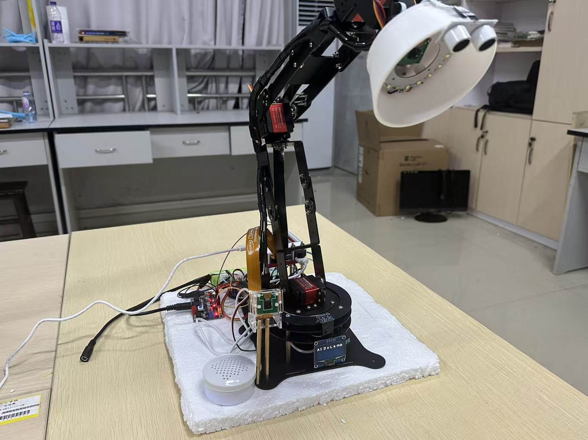
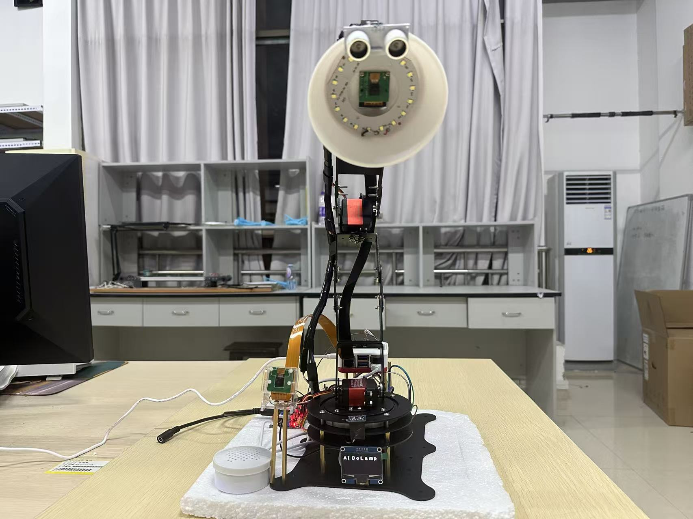

# AIDoLamp - 基于多模态交互与机械臂追踪的智能台灯

<p align="center">
  
  
</p>

基于 **树莓派5 + STM32F407ZGT6** 的多模态交互智能台灯，融合 YOLOv8 目标检测、MediaPipe 手势识别与坐姿检测、自研4轴机械臂逆运动学算法、DeepSeek 语言模型语音交互，实现四种工作模式的智能切换与人-机-环境闭环控制。

## 实物展示

<p align="center">
  
  <br/>
  <sub>需要观看作品演示视频，可联系作者提供。</sub>
</p>

## 技术栈

| 层级 | 组件 | 职责 |
|------|------|------|
| 上位机 | 树莓派5（8GB） | 视觉处理、AI 推理、多线程任务调度 |
| 下位机 | STM32F407ZGT6 | 舵机 PWM 控制、超声波测距、OLED 显示、灯光调节 |
| 机械臂 | 自研4轴（4 舵机） | 底座旋转 + 肩/肘/腕关节，3D 打印灯罩 |
| 视觉 | 双 CSI 摄像头 | cam1（底座）：手势/坐姿；cam2（灯罩）：YOLO 检测 |
| 通信 | UART 115200bps | 树莓派 ↔ STM32 双向通信 |
| 传感器 | TSL2591 + 超声波 + 可编程 LED | 环境光感知、距离检测、自适应调光 |

## 系统架构

```
树莓派5（视觉 & AI 大脑）                    STM32F407（实时控制）
  ├── cam1: MediaPipe 手势识别                 ├── PCA9685 驱动 4路舵机 PWM
  ├── cam1: MediaPipe 坐姿检测                 ├── 超声波测距 → UART 上报
  ├── cam2: YOLOv8 人脸/书本检测               ├── TSL2591 环境光采集 → 自适应调光
  ├── 逆运动学解算 → UART 发送舵机角度          ├── OLED 模式状态显示
  ├── DeepSeek API 语音对话                    ├── PWM 灯光亮度/色温控制
  └── 百度语音 ASR/TTS                         └── 串口命令解析与分发
```

## 四种工作模式

| 模式 | 触发方式 | 功能 |
|------|----------|------|
| **待机模式** | 默认 / 手势切换 | 超声波持续监测，距离突变 >10cm 自动唤醒进入普通模式 |
| **普通模式** | 超声波触发 | 手势控制灯光亮度/色温、舵机方向/高度（10种手势，5指张开3秒激活） |
| **互动模式** | 手势切换 | 多线程：YOLOv8 人脸检测 + 机械臂跟随 + "你好悠悠"语音唤醒 + DeepSeek 对话 + 天气查询 |
| **写作模式** | 手势切换 | 多线程：YOLOv8 书本检测 + 机械臂跟随 + 坐姿检测语音提醒 + 环境光自适应调光 |

## 手势交互设计

系统支持 10 种手势，采用三级状态流转：**未激活 → 激活 → 模式控制**

| 手势编号 | 名称 | 功能 |
|----------|------|------|
| 1 | activate（五指张开） | 激活手势系统（需持续3秒） |
| 3 | exit | 退出当前模式 / 关闭激活状态 |
| 5 | mode1 | 进入待机模式 |
| 6 | mode2 | 进入普通模式 |
| 7 | mode3 | 进入互动模式 |
| 8 | mode4 | 进入写作模式 |
| 10 | up（拇指向上） | 增强光照 / 舵机向上 |
| 2 | down（拇指向下） | 减弱光照 / 舵机向下 |
| 9 | right | 灯身向右 / 色温调节 |
| 4 | left | 灯身向左 / 色温调节 |

防误触机制：激活手势需持续 3 秒，功能手势需持续 1 秒，操作间隔 1 秒防抖。

## 核心算法

- **逆运动学（IK）**：4轴机械臂（L1=8, L2=24, L3=24, L4=8 cm），余弦定理求解肘部角度，支持人脸跟踪（固定肩肘，仅调底座+腕部）和书本跟踪（全4轴联动）
- **手势识别**：MediaPipe 21关键点 → 63维特征 → 随机森林分类器（gesture_model.pkl），支持10种手势
- **坐姿检测**：MediaPipe Pose + FaceMesh，检测头部过低（下巴-肩膀距离阈值）和肩膀倾斜（左右肩高差阈值）
- **目标跟踪**：YOLOv8 检测人脸/书本像素坐标 → 3D空间映射 → IK求解 → 余弦平滑插值发送舵机指令
- **语音交互**：百度 ASR/TTS + DeepSeek 对话 + 和风天气 API，唤醒词"你好悠悠"

## 目录结构

```
AIDoLamp_end/
├── src/                          # 上位机源代码（Python，运行于树莓派5）
│   ├── main.py                   # 主程序入口 & 四模式状态机
│   ├── gesture_class.py          # 手势识别（MediaPipe + RandomForest）
│   ├── posture_class.py          # 坐姿检测（MediaPipe Pose + FaceMesh）
│   ├── csi1.py                   # 综合检测系统（手势+坐姿联合，写作模式用）
│   ├── yolo_class.py             # YOLOv8 目标检测（人脸/书本）
│   ├── object_tracking.py        # 机械臂逆运动学 & 目标追踪
│   ├── serial_comm.py            # UART 串口通信（舵机/灯光/模式控制）
│   └── voice_class.py            # 语音助手（百度ASR/TTS + DeepSeek + 天气）
├── firmware/                     # 下位机源代码（C，STM32F407ZGT6）
│   ├── Core/
│   │   ├── Inc/                  # 头文件
│   │   └── Src/                  # 源文件
│   │       ├── main.c            # STM32 主程序
│   │       ├── contact.c         # 串口命令解析与执行（模式/舵机/灯光）
│   │       ├── chuankou.c        # UART DMA 通信驱动
│   │       ├── PCA9685.c         # PCA9685 舵机驱动（I2C）
│   │       ├── TSL.c             # TSL2591 光照传感器 + 超声波测距
│   │       ├── oled.c            # OLED 显示驱动
│   │       └── ...               # HAL 外设初始化
│   ├── ee.ioc                    # STM32CubeMX 工程配置
│   └── STM32F407ZGTX_FLASH.ld   # 链接脚本
├── training/                     # 各子模块开发 & 训练资料
│   ├── gesture/                  # 手势识别训练（3个版本：pc/pi/重构版）
│   │   ├── mediaPipe_Hands_pc/   # PC 版训练流水线（特征提取→模型训练）
│   │   ├── mediaPipe_Hands_pi/   # 树莓派版
│   │   └── mediaPipe_Hands_重构版本/  # 重构后的模块化版本
│   ├── yolo/                     # YOLOv8 目标检测训练
│   │   ├── identify_pc/          # PC 端训练 & 推理脚本
│   │   ├── identify_pi/          # 树莓派端优化版本
│   │   └── identify_train/       # 独立训练环境
│   ├── robotic-arm/              # 机械臂 IK 算法开发
│   │   ├── Robotic arm linux/    # Linux/树莓派版
│   │   └── Robotic arm window/   # Windows 调试版
│   ├── voice/                    # 语音助手独立开发
│   └── pose/                     # 坐姿检测（LSTM + 规则两种方案）
├── models/                       # 训练好的模型权重（本地保留，不提交git）
│   ├── gesture_model.pkl         # 手势分类模型（RandomForest）
│   └── best.pt                   # YOLOv8 自训练权重（4类：person_a/person_b/person_c/book）
├── docs/                         # 项目文档 & 训练结果可视化
│   ├── gesture_confusion_matrix.png  # 手势识别混淆矩阵
│   ├── gesture_feature_importance.png # 手势特征重要性
│   └── yolo_results.png          # YOLOv8 训练曲线
├── media/                        # 演示媒体
│   ├── side-view.jpg             # 实物侧视图
│   └── front-view.jpg            # 实物正视图
├── .env.example                  # API 密钥配置模板
├── .gitignore
├── requirements.txt              # Python 依赖
└── README.md
```

## 硬件清单

| 硬件 | 型号/规格 | 用途 |
|------|-----------|------|
| 上位机 | 树莓派5（8GB） | 视觉处理 & AI 推理 |
| 下位机 | STM32F407ZGT6 | 实时控制 & 外设管理 |
| 摄像头 | CSI 摄像头 x2 | cam1 底座（手势/坐姿）+ cam2 灯罩（YOLO） |
| 舵机驱动 | PCA9685（I2C） | 4路舵机 PWM 生成 |
| 舵机 | x4 | 底座(-135~135°) / 肩(-90~90°) / 肘(0~150°) / 腕(-90~40°) |
| 光照传感器 | TSL2591（I2C） | 环境光检测，写作模式自适应调光 |
| 超声波模块 | HC-SR04 | 距离检测，待机→普通模式触发 |
| OLED 屏 | 128x64（I2C） | 当前模式与状态显示 |
| LED 灯 | 可编程 PWM 控制 | 灯光亮度/色温调节 |
| 语音模块 | USB 麦克风 + USB 扬声器 | 语音交互 |
| 灯罩 | 3D 打印（自主设计） | 末端执行器，内置 cam2 |

## 下位机固件说明

固件基于 STM32CubeMX + HAL 库开发，核心模块：

| 文件 | 功能 |
|------|------|
| `contact.c` | 串口命令分发：MODE（模式切换）、Alldro（全舵机控制）、LIGHT（灯光调节）等 |
| `PCA9685.c` | I2C 驱动 PCA9685，控制 4 路舵机 PWM（支持 180°/270° 舵机） |
| `TSL.c` | TSL2591 光照采集 + 超声波触发/测距 + PWM 自适应调光 |
| `oled.c` | I2C 驱动 OLED 屏，显示当前模式（待机/陪伴/互动/写作） |
| `chuankou.c` | UART6 DMA 收发 + 命令解析器（支持最多6参数） |

> 编译需要 STM32CubeIDE。打开 `firmware/ee.ioc` 用 CubeMX 生成 HAL 驱动后即可编译。

## 快速开始

### 环境配置

```bash
# 安装 Python 依赖（树莓派环境）
pip install -r requirements.txt

# 树莓派专用库（系统级安装）
sudo apt install python3-picamera2 python3-libcamera

# 配置 API 密钥
cp .env.example .env
# 编辑 .env 填入你的 百度/DeepSeek/天气 API Key
```

### 运行

```bash
# 需要在树莓派上运行，并连接 STM32 下位机
cd src/
python main.py
```

> **前置条件**：`gesture_model.pkl`（手势分类模型）和 `best.pt`（YOLOv8 权重）需要提前放到运行目录。

## License

本项目为课程/竞赛实践作品，仅供学习参考。
